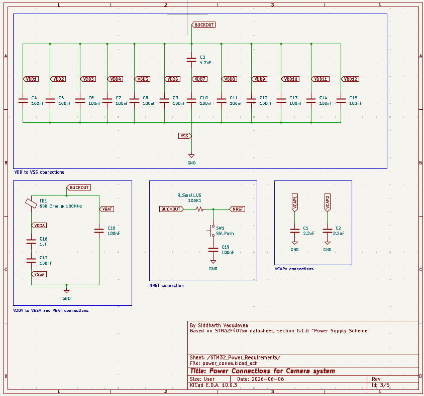
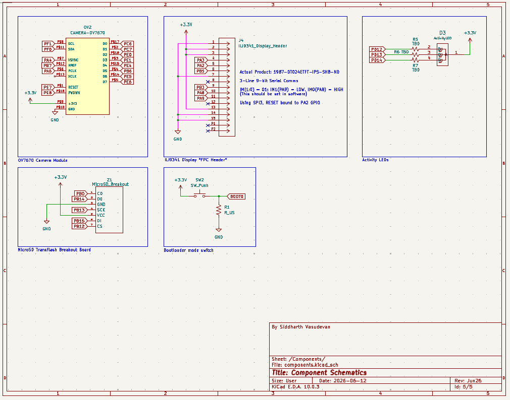

## Component Connections and Layout

### Schematics

#### STM32 Power Requirements Schematic (power_conns.kicad_sch)
This schematic is based off of the power requirements detailed in the [STM32 F405xx/F407xx datasheet](https://www.st.com/content/ccc/resource/technical/document/datasheet/ef/92/76/6d/bb/c2/4f/f7/DM00037051.pdf/files/DM00037051.pdf/jcr:content/translations/en.DM00037051.pdf) and cross-checked with the [ST Application Note AN4488](https://www.alldatasheet.com/datasheet-pdf/view/701384/STMICROELECTRONICS/AN4488.html) for good measure.

#### Power Supply and Charging Schematic (buck.kicad_sch)
This schematic contains all of the circuitry necessary to make charging possible and exposes pins to the battery. It includes connections for a USB-C socket that serves as the charging port for the camera, connections for the Dynamic Power Path Management IC (charging + power management), the buck converter circuitry to efficiently step down the battery's 3.7V to 3.3V, and the battery terminals, which will use an XH socket. (Initially I planned to have the buck converter on a separate schematic, hence the filename, but there wasn't enough detail to justify a separate schematic)

#### Components Schematic (components.kicad_sch)
This schematic contains the component connections that provide all the functionality of a camera. It contains the OV7670 Camera Module, the ILI9341 Display header, activity LEDs, and the MicroSD transflash breakout board.

#### STM32F407 schematic (f407zgt6.kicad_sch)
Contains the STM32F407ZGT6 LPQF144 chip. In the near future I will put more circuits in this schematic, such as the bootloader switch. 

### Layout

